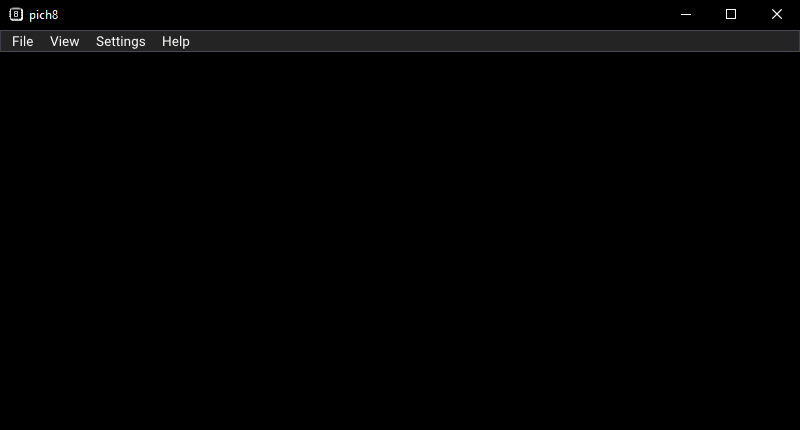

# pich8
A cross-platform CHIP-8 and SUPER-CHIP interpreter and debugger written in Rust

I've recently decided to look into emulators and found many recommendations to start with a CHIP-8 interpreter.  
Since I had just started to read [the book](https://doc.rust-lang.org/book/), I've decided to use this opportunity as my first Rust project.  
I can definitely recommend giving it a try, I learned a lot during this journey.



## Features

- Cross-platform
- Support for CHIP-8 and SUPER-CHIP 1.1 (S-CHIP)
- Supports screen resolutions 64x32, 64x64 (CHIP-8 HiRes) and 128x64 (S-CHIP)
- Rendering and sound using native Rust crates [glium](https://github.com/glium/glium) and [rodio](https://github.com/RustAudio/rodio)
- GUI using crate [imgui-rs](https://github.com/Gekkio/imgui-rs) (Rust bindings for [Dear ImGui](https://github.com/ocornut/imgui))
- Load ROMs from local file system or download them directly from a URL
- Save and load current CPU state
- Fullscreen mode and possibility to change background and foreground colors
- Change CPU speed dynamically
- Disable several quirks (enabled by default) and vertical wrapping (some ROMs require specific quirks or vertical wrapping disabled)
- Debug windows displaying current register values, stack and executed opcodes as well as allowing to set breakpoints

## Building

Make sure the rust toolchain is installed (on Windows both gnu and msvc are fine), best using [rustup](https://rustup.rs/).

### Windows

You can simply build using cargo or run directly.
```
> cargo build
```

### Linux

You need to install the required packages, on a Debian/Ubuntu based system:
```
$ sudo apt install gcc g++ libasound2-dev libssl-dev
$ cargo build
```
On a Fedora based system:
```
$ sudo yum install g++ alsa-lib-devel openssl-devel
$ cargo build
```
 
If you run `cargo build --no-default-features`, you won't need the openssl package, but then it's not possible to download ROMs from the internet.

Note: I couldn't get the application to run in a Linux VM due to [this issue in glutin](https://github.com/rust-windowing/glutin/issues/1262).

### macOS

I have no macOS system, but I assume it should work if you have a proper build system installed.

## Sources for CHIP-8 ROM files

- https://github.com/JohnEarnest/chip8Archive
- https://www.zophar.net/pdroms/chip8.html
- https://github.com/loktar00/chip8/tree/master/roms
- https://github.com/dmatlack/chip8/tree/master/roms
- https://github.com/00laboratories/00SChip8/tree/master/games

## Resources

- https://github.com/tobiasvl/awesome-chip-8
- http://www.pong-story.com/chip8/ (especially CHIP8.DOC)
- http://devernay.free.fr/hacks/chip8/C8TECH10.HTM
- http://devernay.free.fr/hacks/chip8/schip.txt
- http://devernay.free.fr/hacks/chip8/
- https://en.wikipedia.org/wiki/CHIP-8
- http://www.multigesture.net/articles/how-to-write-an-emulator-chip-8-interpreter/
- https://github.com/JohnEarnest/Octo
- https://github.com/tomdaley92/kiwi-8a
